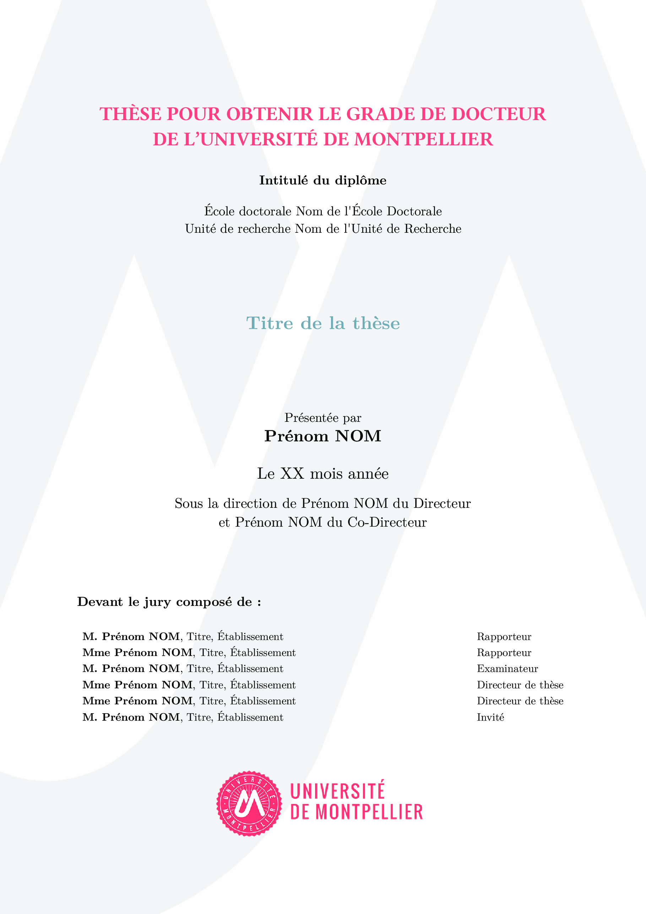
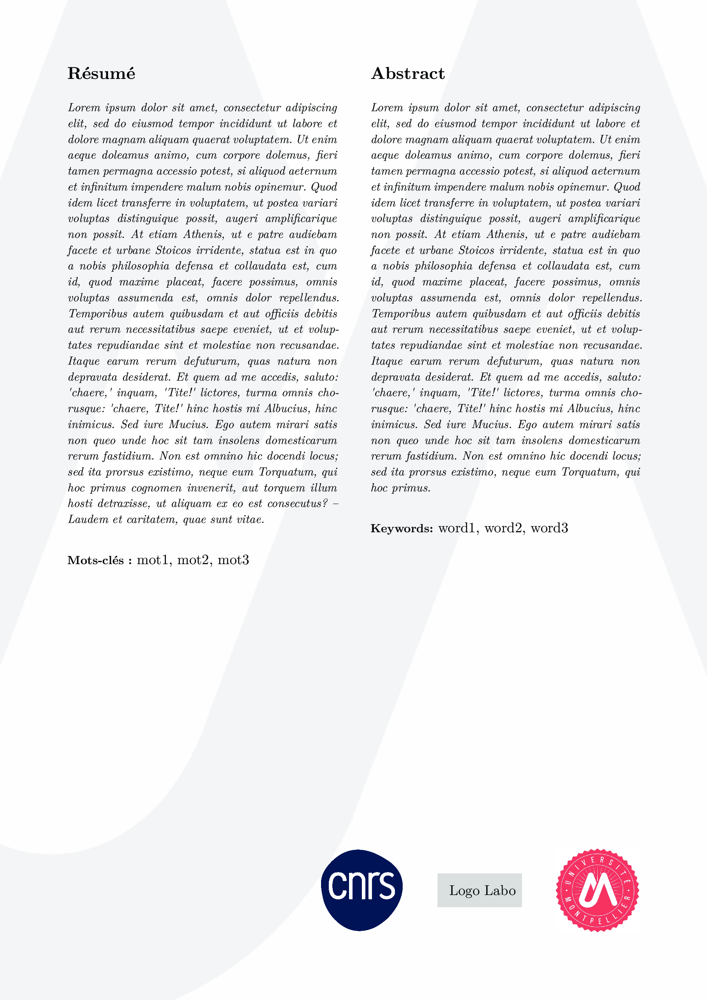

# University of Montpellier Thesis Template (Typst)

A Typst thesis template for the University of Montpellier.

This project aims to reproduce the university's thesis layout and visual identity in Typst. All official guidelines have been followed as much as possible.

## Preview

<table>
  <tr>
    <td></td>
    <td></td>
  </tr>
</table>

Full document preview: [main.pdf](main.pdf)

## Project Structure

- `main.typ`: main document assembly and global layout configuration
- `metadata.typ`: thesis metadata variables (title, author, supervisors, etc.)
- `chapters/00-frontpage.typ`: front page content
- `chapters/00-liminar.typ`: preliminary pages
- `chapters/01-introduction.typ`: example chapter content
- `chapters/99-appendices.typ`: appendices section
- `chapters/99-lastpage.typ`: final page content
- `bib/references.bib`: bibliography database
- `assets/global/`: logos, background, and preview images

## Usage

1. Install Typst: https://typst.app/
2. Edit your metadata in `metadata.typ`.
3. Edit chapter files in `chapters/`.
4. Compile:

```bash
typst compile main.typ main.pdf
```

## Notes

- Depending on your faculty, doctoral school, or jury-specific requirements, local adjustments may still be needed before submission.
